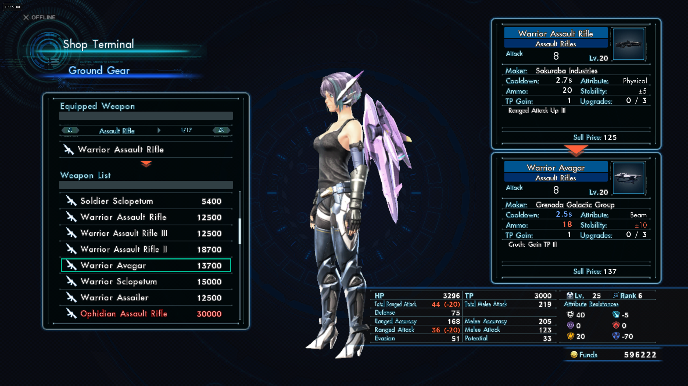
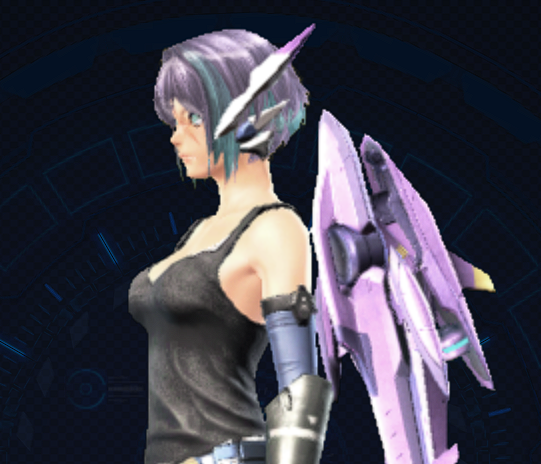
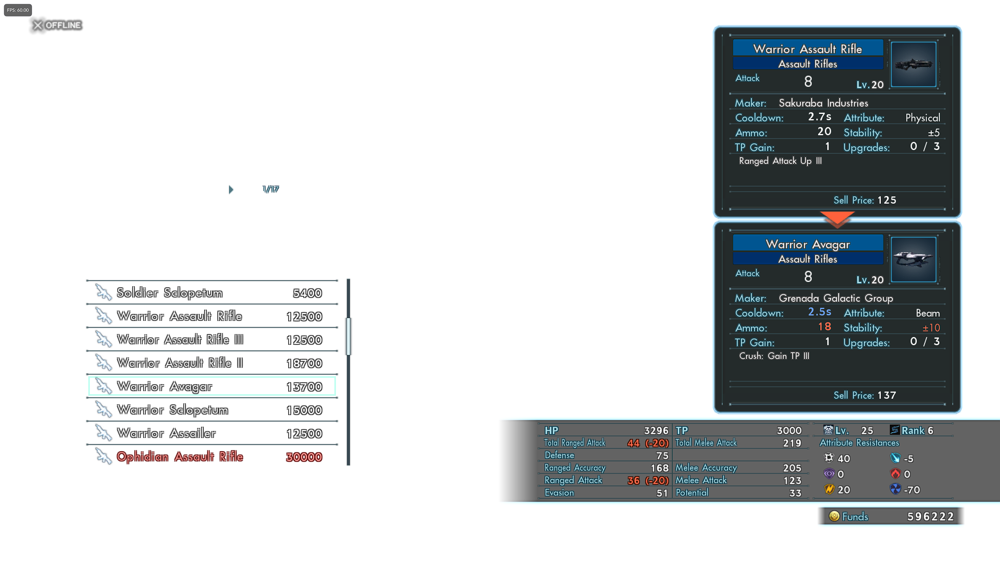
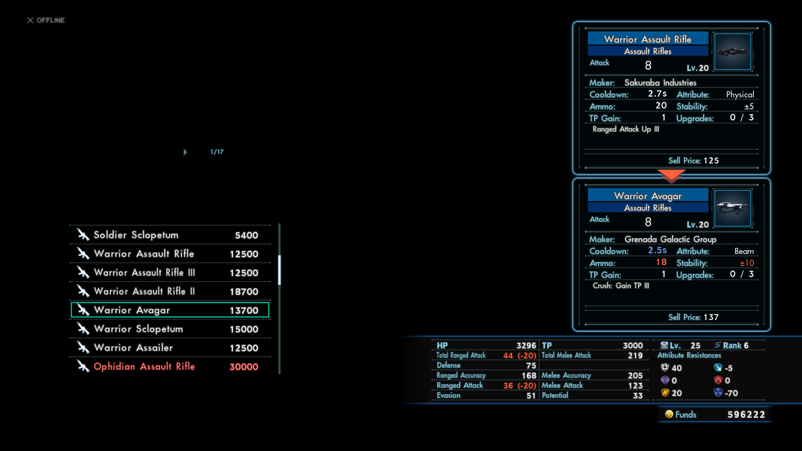
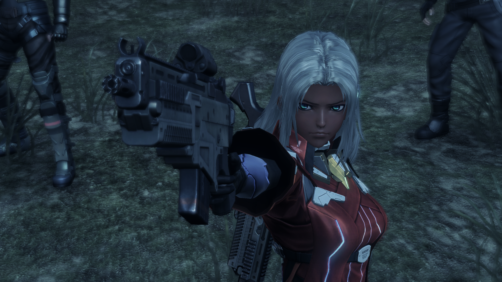

### Xenoblade X (cemu) Flickering Issue
------
This is an experimental WIP tweaking of cemu graphics pack v5 regarding a flickering issue when using vulkan and a resolution of 1440p. Issue occurs at 4K, but my target is 1440p. Using an AMD RX 5700 xt and cemu v1.22.0. Issue is known on the [wiki](https://wiki.cemu.info/wiki/Xenoblade_Chronicles_X#Screen-Wide_Flicker) as a problem with the vulkan renderer.

I will preface that I am a novice who is just screwing around with an existing mod, not the creator. Latest graphics pack here: https://actualmandm.github.io/cemu_graphic_packs/

Flickering seems to occur when:
- Using in-battle command menu (+)
- Shopping for equipment at terminals.

The issue appears to be solely caused by the Resolution graphics pack ([v4 version here](https://github.com/ActualMandM/cemu_graphic_packs/tree/master/Resolutions/XenobladeX_Resolution)) to push beyond 1080p. Contradictory to the wiki, this does not seem to occur due to the 60fps mod or other mod packs. The issue does not occur at 1080p with the resolution mod. This issue also does not occur running with openGL, but good luck in the current year being able to hit the 60fps target.

Currently, the issue it appears to be caused by two things in the resolution mod only:
- Texture Redefine In-game Menus
- Texture Redefine Shadows

_Removing these settings ([in the rules text](https://github.com/chrisbrasington/xcx_vulkan_resolution_flicker_1440p_fix/blob/master/src/XenobladeX/Graphics/rules.txt)) moves the game from unplayable to 99% reasonable._ Further experimentaion is needed. 
Flickering previously was so sever as to cause the character model not to render. Now, shopping at terminals will render the character model at a lower resolution. Shadow quality is decreased (but not in an overtly noticable way to my eye). 

White flickering may still occur for some reasons:
- Clicking out of cemu to another window, can directly result in white background - flickering. 
- The world terminals can clip through the in-game-menu and flicker on top of the character model incorrectly. (will not occur facing away from terminals, seems to be lighting related)

Single-Core, Multi-Core recompiler does not seem to make an impact. Neither does the 60fps mod or other mods.

------
Fix: Rendering base game at 1440p, but rendering in-game shopping menu model at lower native 720p:

Bug Prior to Fix:

This is of course with running the base game at 1440p:

Happy gaming.
------
##### I'm probably not merging this back anywhere as it may be more a bug with cemu's vulkan usage, which is closed source. And it just disables some functionality of the 60fps (which again, does work correctly with openGL) - some functionality I am unlikely to persue fixing in its entirety. Feel free to take a whack at it yourself. 
------
### Fork Information
------
This repo is for working on updating packs for version 5. Once the packs are ready, they will be pushed back to [cemu_graphic_packs](https://github.com/slashiee/cemu_graphic_packs) and this repo will be archived.